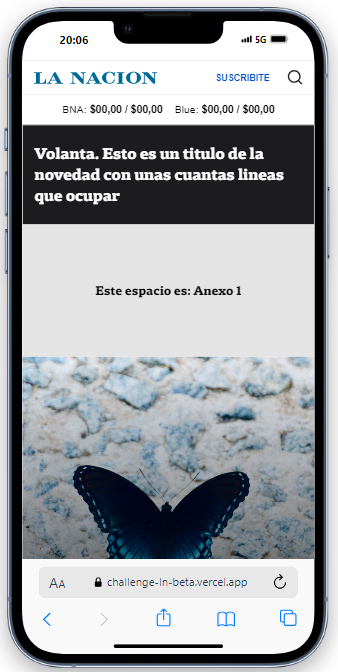
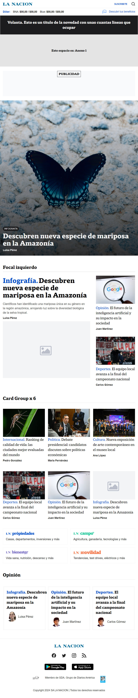
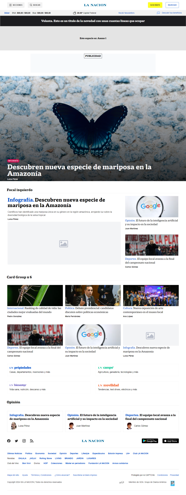
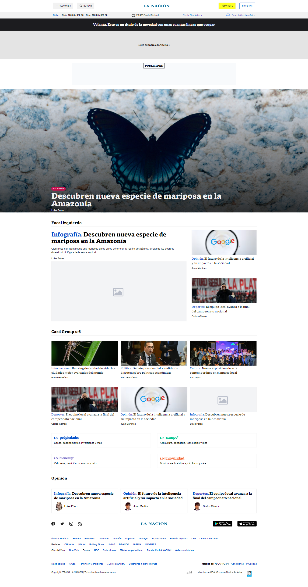

# La Nacion Challenge Frontend

Este proyecto es una recreación del diseño de la web de La Nación de manera mas resumida, siguiendo las especificaciones y la estética proporcionadas en Figma. Se maquetó aplicando el concepto de First Mobile para garantizar una experiencia óptima en diferentes dispositivos y tamaños de pantalla.

Se implementó Compound Components pattern en la estructura del código, permitiendo una mayor flexibilidad y reutilización de componentes a lo largo del proyecto.

## Tecnologías Utilizadas

- React
- TypeScript
- Tailwind CSS

## Librerías y APIs

- **React Helmet**: Se utilizó para optimizar el SEO del proyecto. https://www.npmjs.com/package/react-helmet
- **Axios**: https://www.npmjs.com/package/axios
- **Tomorrow.io API**: Integra datos en tiempo real sobre el clima para proporcionar información actualizada. https://www.tomorrow.io/

## Capturas de Pantalla

| Pantalla 360px              | Pantalla 768px              |
|-----------------------------|-----------------------------|
|  |  |

| Pantalla 1366px             | Pantalla 1920px             |
|-----------------------------|-----------------------------|
|  |  |

